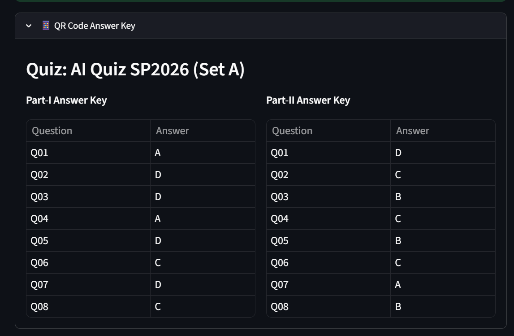

# Automated Quiz Scanner & Grading System

An AI-powered desktop application built for the **Artificial Intelligence (BSE-4A) SP2026** course assignment. It automatically scans filled quiz sheets, decodes QR codes to get the answer key, reads handwritten student information via OCR using Google Gemini Vision API, grades the bubbles, and exports a detailed Excel/CSV report.

## 🚀 Features (Tasks Completed)
- [ ] **Task 1: QR Code Decoding** - Extracts the answer key directly from the QR code on the quiz sheet.
- [ ] **Task 2: Student Info Extraction (OCR)** - Reads handwritten Name and Registration Number using Google Gemini Vision API for accurate handwriting recognition.
- [ ] **Task 3: Bubble Sheet Reading** - Detects filled bubbles using contour detection and fill-ratio analysis. Handles multi-filled (invalid) and unattempted questions.
- [ ] **Task 4: Quiz Grading** - Compares student answers against the QR key and generates a score with a per-question breakdown.
- [ ] **Task 5: Batch Processing** - Processes entire folders of quiz images at once and exports results to a single Excel/CSV file with summary statistics.

## 🛠️ Technology Stack
- **Core Language**: Python 3.10+
- **Computer Vision**: OpenCV (`opencv-python`), NumPy
- **QR Decoding**: `pyzbar`
- **OCR (Handwriting)**: Google Gemini Vision API (`google-generativeai`) + `easyocr` as fallback
- **AI Model**: `gemini-2.5-flash` for handwritten text recognition
- **Data & Reports**: `pandas`, `openpyxl`
- **User Interface**: `streamlit` (Browser-based GUI)
- **Environment Management**: `python-dotenv`

## 📁 Folder Structure
```
quiz-scanner/
├── src/                  # Core source code modules
│   ├── preprocessing/    # Image cleanup and rotation fix
│   ├── qr_decoder/       # QR code detection
│   ├── ocr/              # Student info extraction (Gemini Vision API)
│   ├── bubble_detection/ # Answer grid reading
│   ├── grading/          # Score calculation
│   ├── batch_processing/ # Folder processing logic
│   ├── reporting/        # CSV/Excel export
│   ├── ui/               # Streamlit web app
│   └── utils/            # Shared helpers & config
├── samples/              # Sample quiz sheets (not tracked in git)
├── output/               # Generated reports and debug images (not tracked in git)
├── tests/                # Unit tests
├── .env.example          # Environment variable template
├── config.py             # Global configuration settings
└── requirements.txt      # Python dependencies
```

## ⚙️ Installation & Running

1. **Clone the repository:**
   ```bash
   git clone https://github.com/Hassan-khan-5535/quiz-scanner-and-grading-system.git
   cd quiz-scanner-and-grading-system
   ```

2. **Install dependencies:**
   ```bash
   pip install -r requirements.txt
   ```

3. **Set up your Gemini API Key:**
   - Copy the example env file:
     ```bash
     cp .env.example .env
     ```
   - Open `.env` and add your key:
     ```
     GEMINI_API_KEY=your_actual_api_key_here
     ```
   

4. **Run the Application:**
   ```bash
   streamlit run src/ui/app.py
   ```
   *The application will open automatically in your web browser.*

## 🔐 Environment Variables

| Variable | Description | Required |
|---|---|---|
| `GEMINI_API_KEY` | Google Gemini Vision API key for handwriting OCR | ✅ Yes |

> ⚠️ **Never commit your `.env` file!** It is already listed in `.gitignore` to protect your API key.

## 📸 Demo
*(Screenshots will be added here upon completion)*




---
**Course:** Artificial Intelligence (BSE-4A)
**Semester:** SP 2026

## 👥 Group Members

| Name | Registration No |
|------|----------------|
| Hassan Khan | FA24-BSE-004 |
| Atif Khan | FA24-BSE-011 |
| Murad | FA24-BSE-036 |
